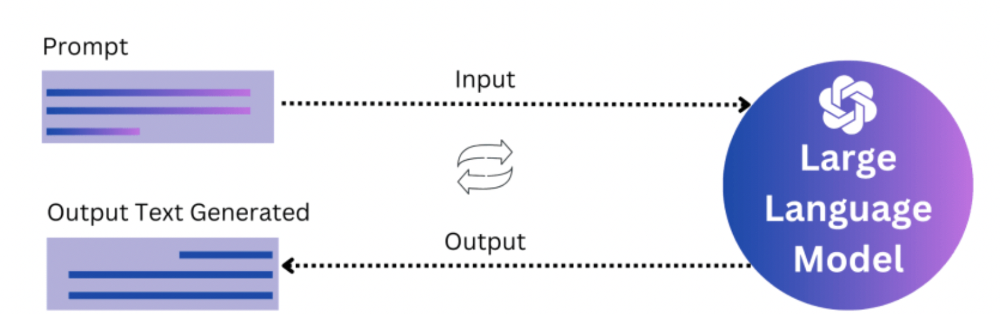
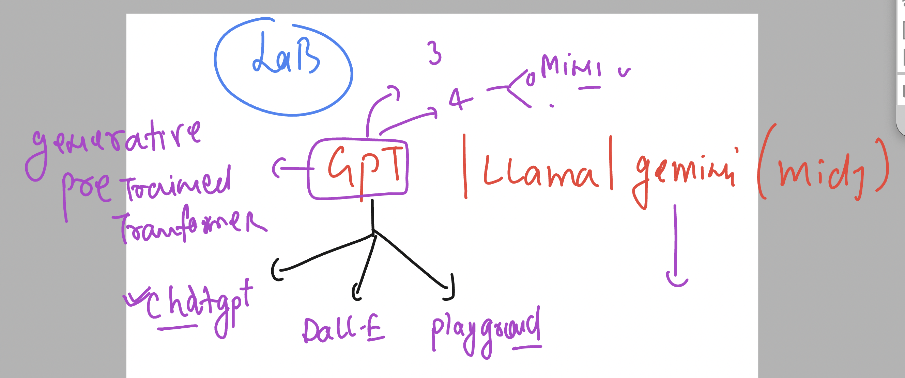
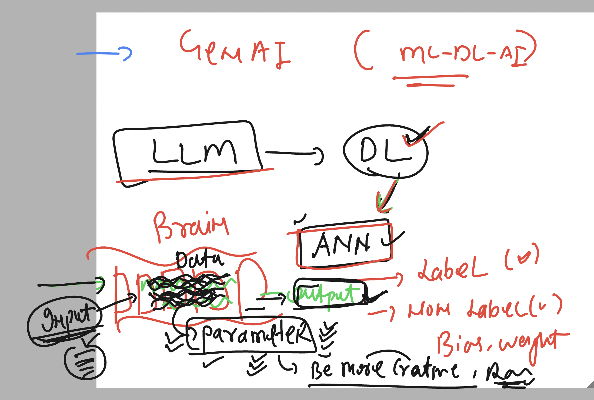
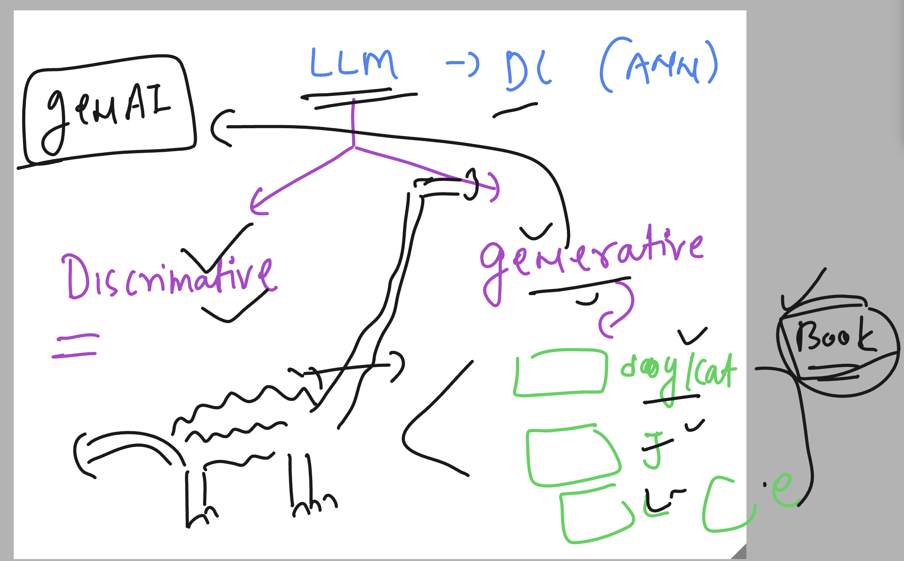
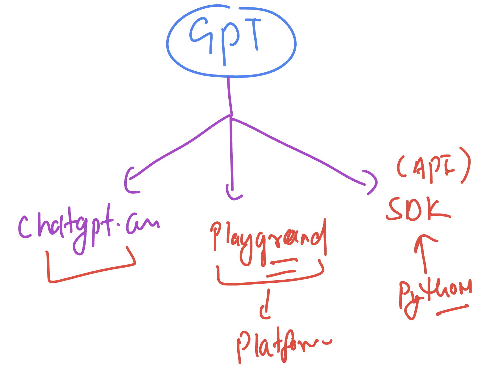
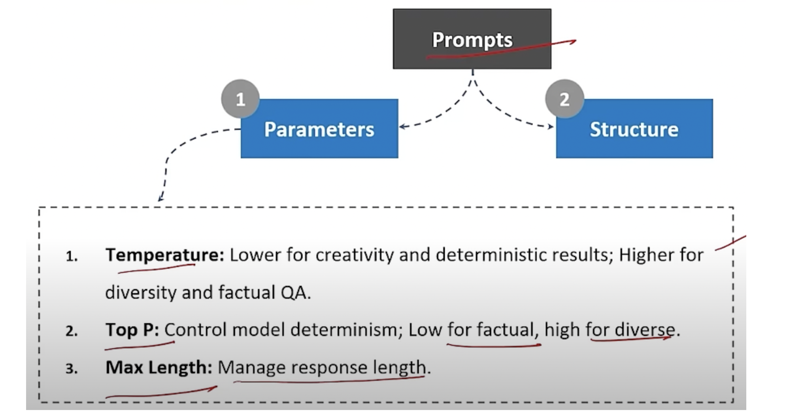

### intro to prompt engineering 

### Basic of Ai model 

### Basic understanding of LLM 

## lab usage 

## LLM with DL (ANN)

### GENAI understanding 

### GPT model offerings 

## Prompt basic info 

### Understanding gpt model parameters 

