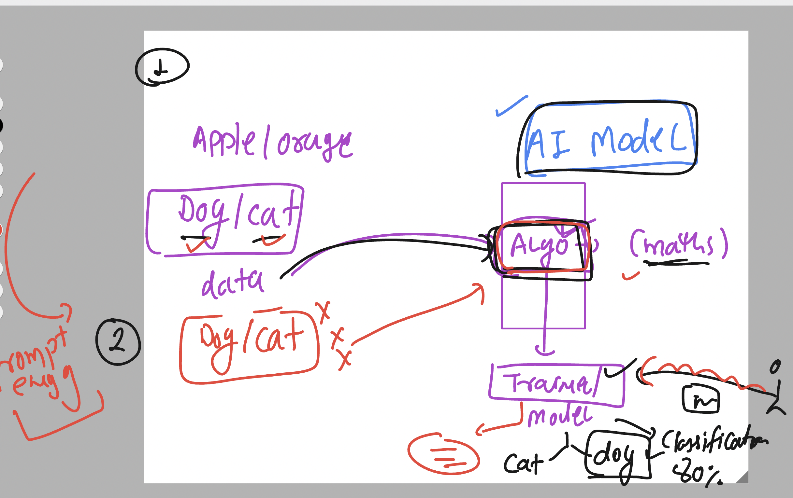

### intro to prompt engineering 


### Basic of Ai model 



### Basic understanding of LLM 


## lab usage 


## LLM with DL (ANN)


### GENAI understanding 


### GPT model offerings 


## Prompt basic info 


### Understanding gpt model parameters 


### prompt format 


### sample example of sentiment analysis 

```
context: " act as an analyst working on OTT platform. you will have to perform sentiment analysis based on feedback provided by the consumers on OTT movies and series. ""

Instruction: " classify feedback as neutral , negative or positive , where positive is promotor ; negative is demotor and neutral is neither promotor or demotor ""

Example:  
Feedback: i think the series was okey .
sentiment: Neutral 
Feedback: the action of each character in the series was awesome.
sentiment: Positive 

Input data and output Indicator : 
Feedback:  the storyline for the series was repetitive and absymal . 
sentiment: 

```


## common prompt patterns 


### prompt 2 

```
Context: “Assume I am a beginner at the topic of online shopping.”
Query: “Explain to me the basics of online shopping including common pitfalls and mistakes”
Format: Output the result as a short paragraph with a bulleted list of common mistakes.
Tone: Keep a bright and positive tone appropriate for beginner education.
Length: Paragraph has a max length of 50 words. Each bulleted list item has a max length of 15 words.
Constraints: Avoid technical jargon. Include at least 5 common mistakes.
has context menu
```


### advanced prompting strategy 


