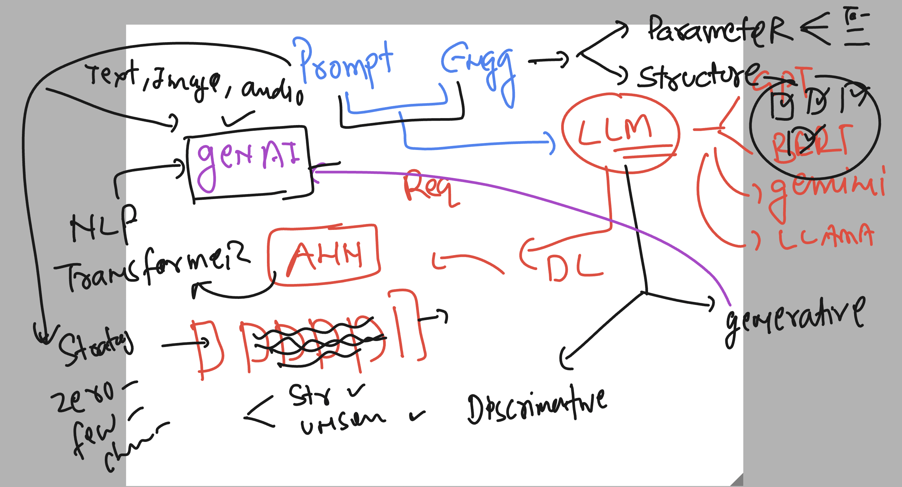
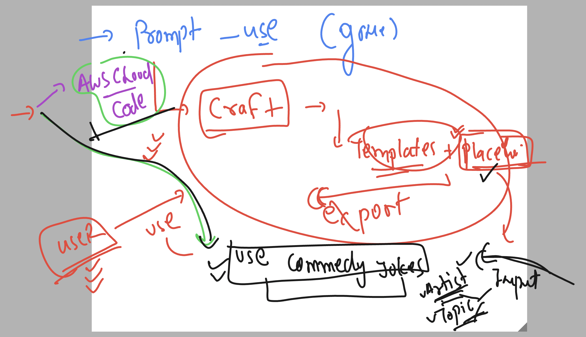
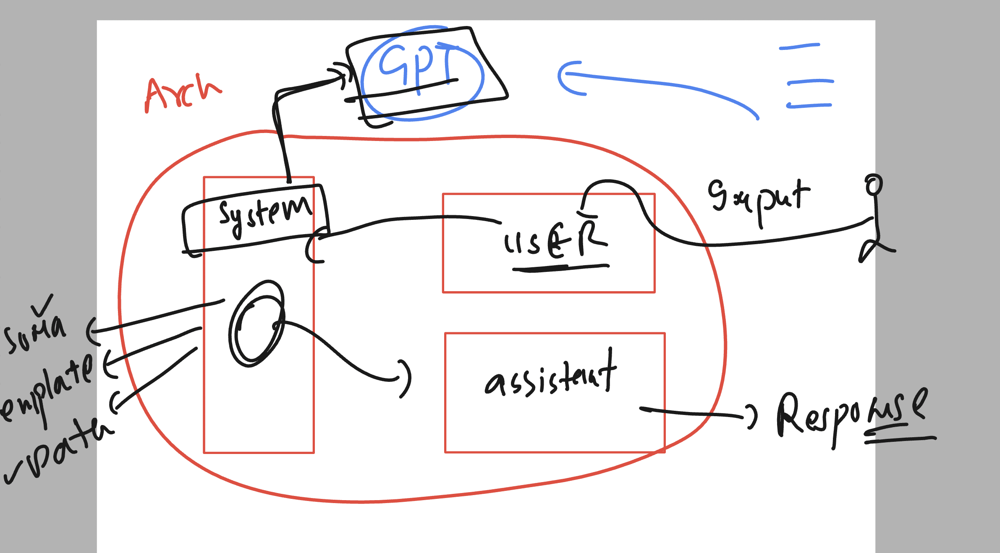
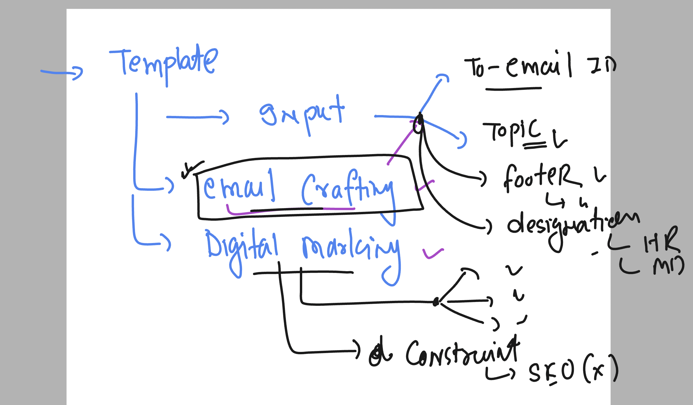

### Basic info 



## Introduction to Text prompting 

### find emails 

```
@Gmail find all emails related to 'flight confirmation or air tickets confirmation'.
Organize the results in table format containing columns for sender , receiver and brief summary about the email content 
```

### finding over google drive 

```
@Google Drive ind all the documents related to invoices  ? should be in pdf format.
make sure invoices are related to walmart only. 
```

### expecting answer from a specific knowledge base

```
@Google Drive "aws_RDS_Redshift_dynamodb" only consider this specific file in your answer.
your task is to analyze the file and give me below listed information.
1. give me overall summary 
2. give 5 takeaways 
```

### youtube video analysis 

```
@YouTube https://www.youtube.com/watch?v=p7HKvqRI_Bo
Analyze this video and tell me few insights about that as per listed below
1. why video is engaging 
2. why it performed so well youtube views
3. what are the target audiance for this video

```

## Prompt templating 




### GPT model internal data details 



## task for the day 



