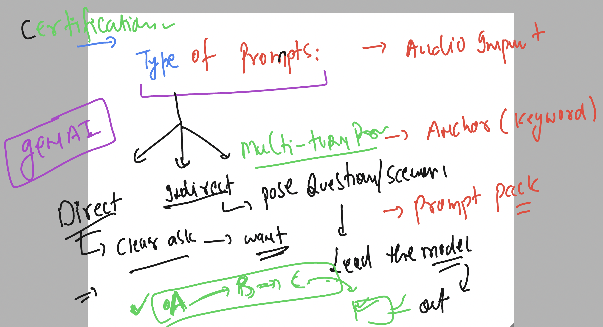
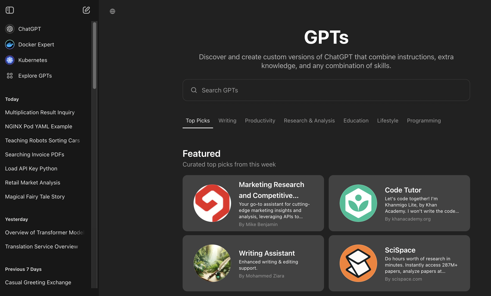
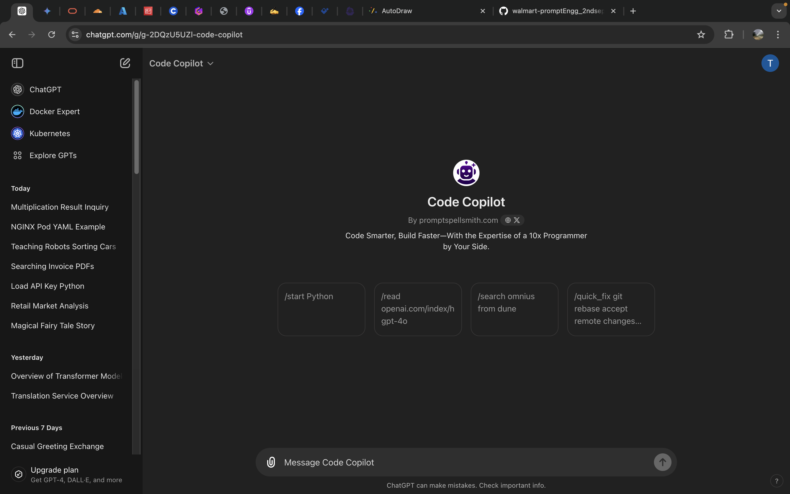
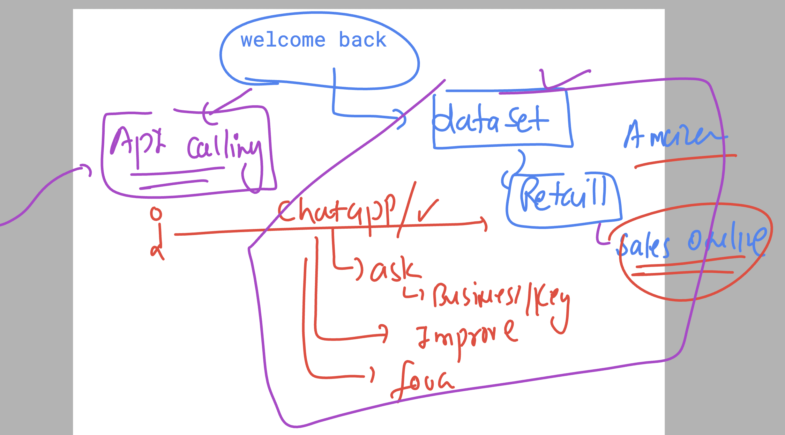
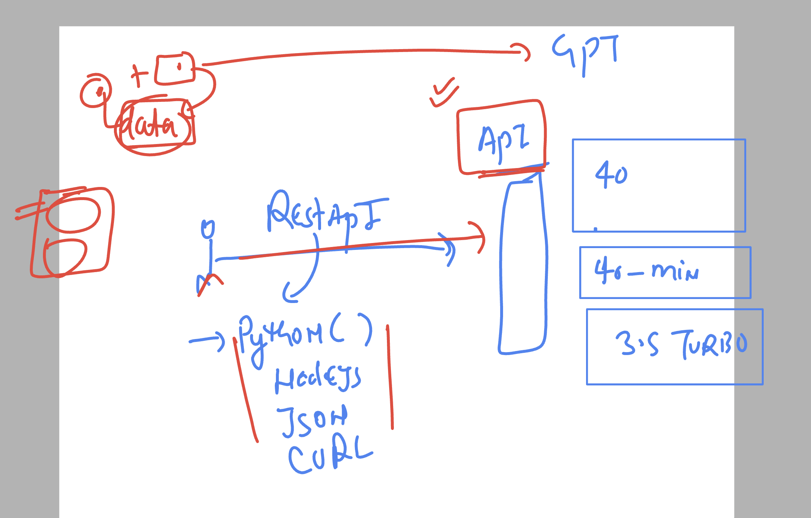

### Type of prompts 



### Recepie pattern prompt 


## custom GPT ---



### code copilot 



## prompting for developer and data analyst



### using python api 




### checking vscode terminal in codespace

```
redashu ➜ /workspaces/walmart-promptEngg_2ndseptb2 (master) $ uname 
Linux
@redashu ➜ /workspaces/walmart-promptEngg_2ndseptb2 (master) $ python -V
Python 3.12.1
@redashu ➜ /workspaces/walmart-promptEngg_2ndseptb2 (master) $ cat  /etc/os-release 
NAME="Ubuntu"
VERSION="20.04.6 LTS (Focal Fossa)"
ID=ubuntu
ID_LIKE=debian
PRETTY_NAME="Ubuntu 20.04.6 LTS"
VERSION_ID="20.04"
HOME_URL="https://www.ubuntu.com/"
```

### Installing openAI module for python 

## openAI api Ref

[click_here](https://platform.openai.com/docs/api-reference/introduction)


```
pip install openai
```

