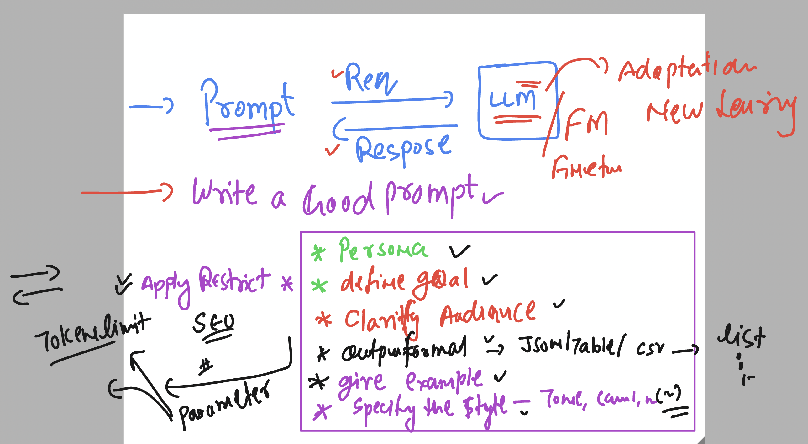
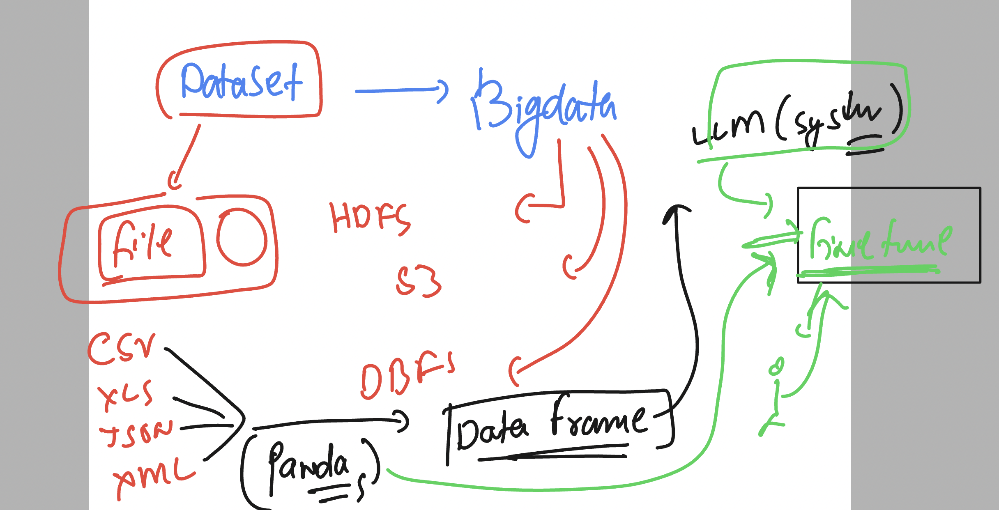

### Basic info 

### Writing a Good prompt 




## Pring of openai API keys 

[check_pricing](https://openai.com/api/pricing/)

### External data sources options in response consideration 




### prompt --

```
analyze the key factor influencing the sales performance of give online market place data.
consider aspects such as customer reviews , pricing strategy , product descriptions and competition
```

## Generation of images using GEN AI LLM


## Some image generation model 

### basedlabs

```
https://www.basedlabs.ai
```

###  HaiPer 

```
https://haiper.ai/
```

### Leonardo AI 

```
https://leonardo.ai/
```